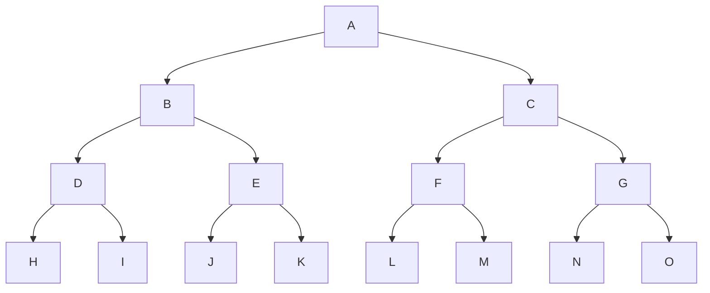
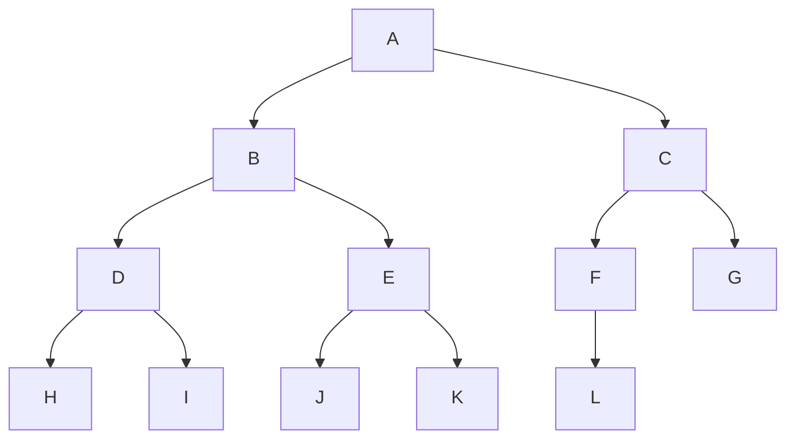

# 트리(Tree)

= 실제 트리를 거꾸로 세워 놓은 형태의 계층적 자료구조

- 삽입이나 삭제 후에도 정렬 상태를 유지하기 위해 O(N) 시간이 소요되는 list 의 단점 보완

## 특징

1. 연결 그래프
1. 사이클이 없다.
1. 정점 - 간선 = 1

-> 위 3가지 중 2가지 조건을 만족하면 트리! 

​	2가지 조건을 만족하면 나머지 하나의 조건도 만족하게 된다.

## 왼쪽자식-오른쪽형제(Left Child-Right Sibling) 표현

=> 차수가 일정하지 않은 일반적인 트리를 구현하기에 매우 효율적

- HTML, XML의 문서 트리, 운영체제의 파일시스템, 탐색트리, 이항(Binomial)힙, 피보나치(Fibonacci)힙 과 같은 우선순위큐에서 사용 

# 이진트리(Binary Tree)

= 각 노드의 자식 수가 2 이하인 트리

## 이진트리 종류

### 포화이진트리(Full Binary Tree)

= 모든 이파리의 깊이가 같고 각 내부노드가 2개의 자식노드를 가지는 트리

ex)

### 완전이진트리(Comeplete Binary Tree)

= 마지막 레벨을 제외한 각 레벨이 노드들로 꽉 차있고, 마지막 레벨에는 노드들이 왼쪽부터 빠짐없이 채워진 트리

## 이진트리의 연산

### 1) 전위순회(Preorder Traversal)

부모 - L - R 방문

= 노드 n에 도착했을 때 n을 먼저 방문한다. 그 다음에 n의 왼쪽 자식노드로 순회를 계속한다. n의 왼족 서브트리의 모든 노드들을 방문한 후에는 n의 오른쪽 서브트리의 모든 후손 노드들을 방문한다. 

### 2) 중위순회(Inorder traversal)

L - 부모 - R 방문

= 노드 n에 도착하면 n의 방문을 보류하고 n의 왼쪽 서브트리로 순회를 진행한다. 즉, 왼쪽 서브트리의 모든 노드들을 방문한 후에 n을 방문한다. n을 방문한 후에는 n의 오른쪽 서브트리를 같은 방식으로 방문한다. 

### 3) 후위순회(Postorder traversal)

L - R - 부모 방문

= 노드 n에 도착하면 n의 방문을 보류하고 n의 왼쪽 서브트리로 순회를 진행한다. n의 왼쪽 서브트리를 방문한 후에는 n의 오른쪽 서브트리를 같은 방식으로 방문한다. 그리고 마지막에 n을 방문한다. 

### 4) 레벨순회(Level-order Traversal)

= 루트가 있는 최상위 레벨부터 시작하여 각 레벨마다 좌에서 우로 노드들을 방문한다.

# 우선순위큐(Priority Queue)

= 가장 높은 우선순위를 가진 항목을 접근, 삭제, 삽입 연산을 지원하는 자료구조

- 파이썬은 heapq 라이브러리 제공

# 이진힙(Binary Heap)

= 부모의 우선순위가 자식의 우선순위보다 높은 우선순위큐 자료구조

- 완전이진트리
- 키값이 작을 수록 높은 순위 => 최소힙
- 키값이 클 수록 높은 순위 => 최대힙
- 최소힙 기준 
  - 삭제 연산 -> downheap
  - 삽입 연산 -> upheap

---

## 참고

### 서적

파이썬과 함께하는 자료구조의 이해 - 양성봉
